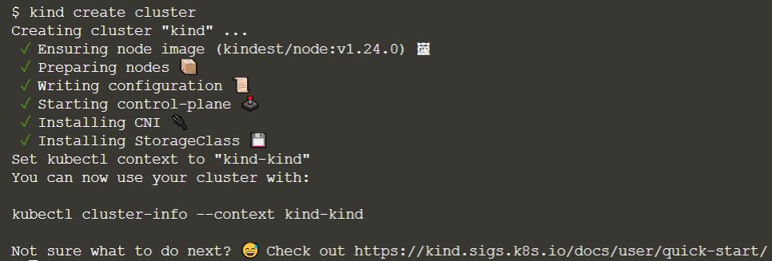

kind is a tool for running local Kubernetes clusters using Docker containers as Kubernetes Nodes. To see how this work, let’s create a cluster with the default settings:

`kind create cluster`{{execute}}

By default, this will create a single Kubernetes node running as a docker container named `kind-control-plane` and configures kubectl to use this cluster. You can view the Docker container running your cluster through the docker ps command:

`docker ps`{{execute}}

Or through your newly configured `kubectl`.

`kubectl get nodes`{{execute}}

You can delete your cluster at any time using the `kind delete cluster` command:

`kind delete cluster`{{execute}}

You can also run a specific version of Kubernetes using the --image flag. For example, to create a Kubernetes cluster using version 1.14.10 of Kubernetes you would use the following command:

`kind create cluster --image kindest/node:v1.14.10`